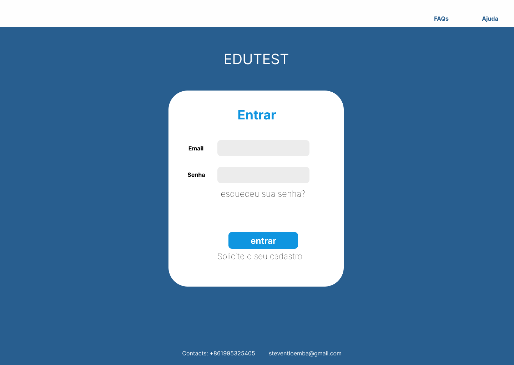
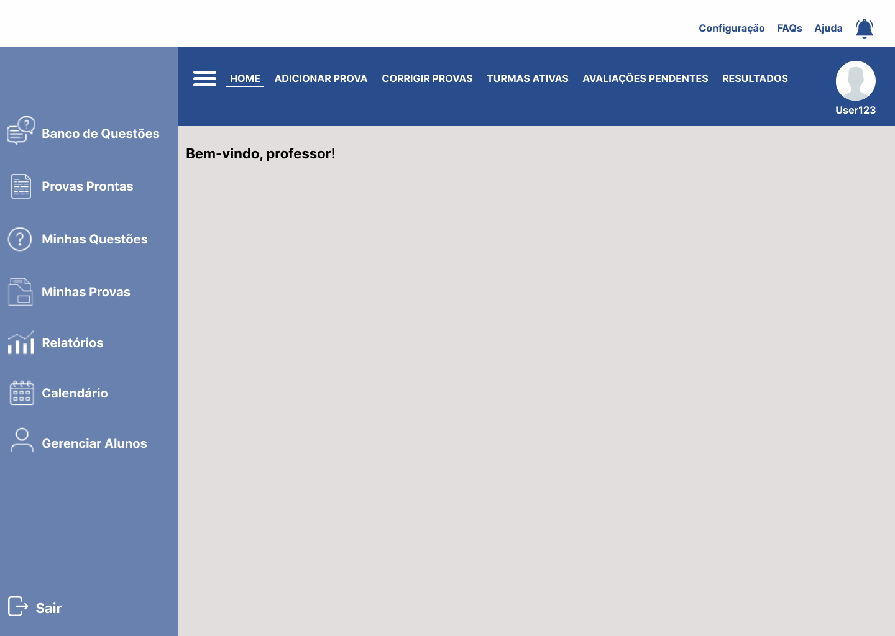
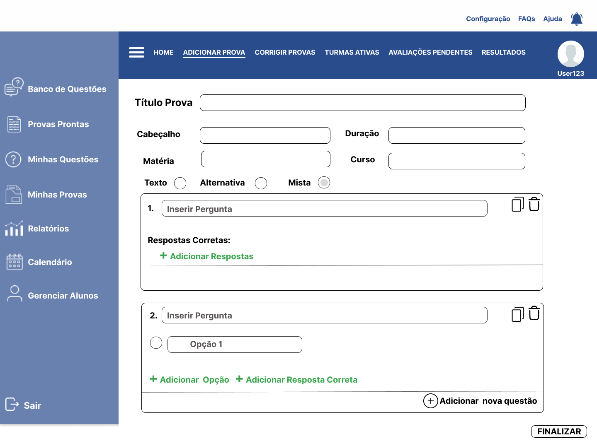
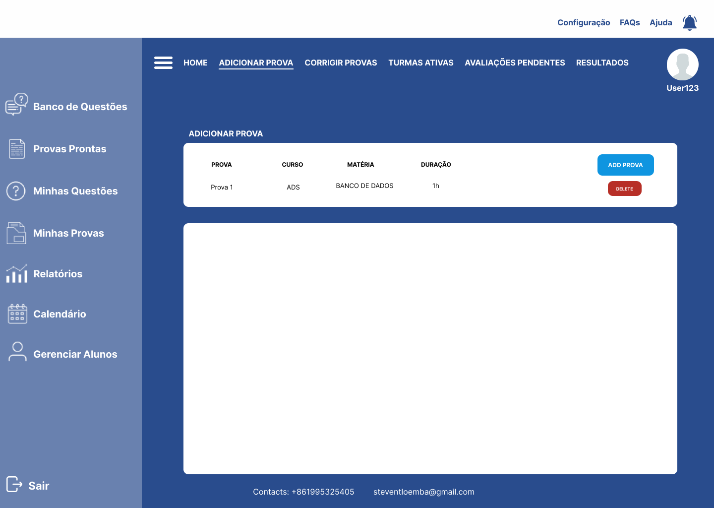
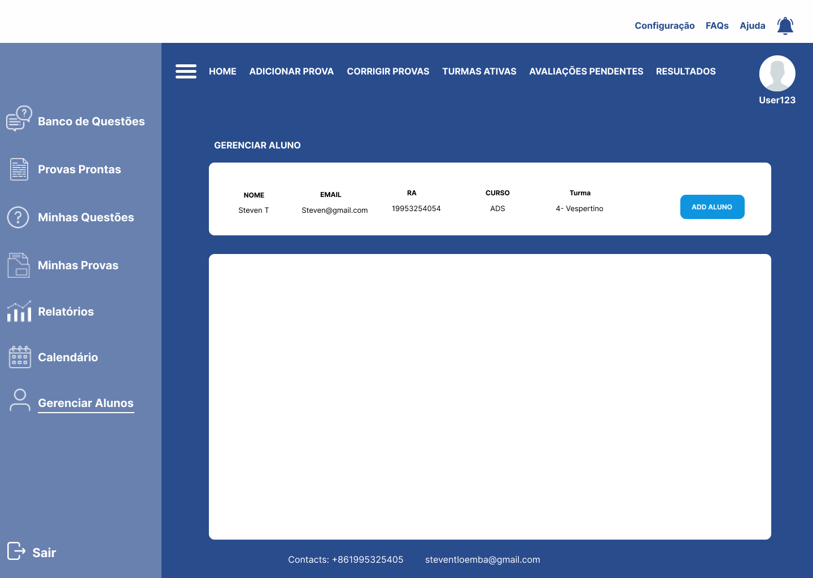
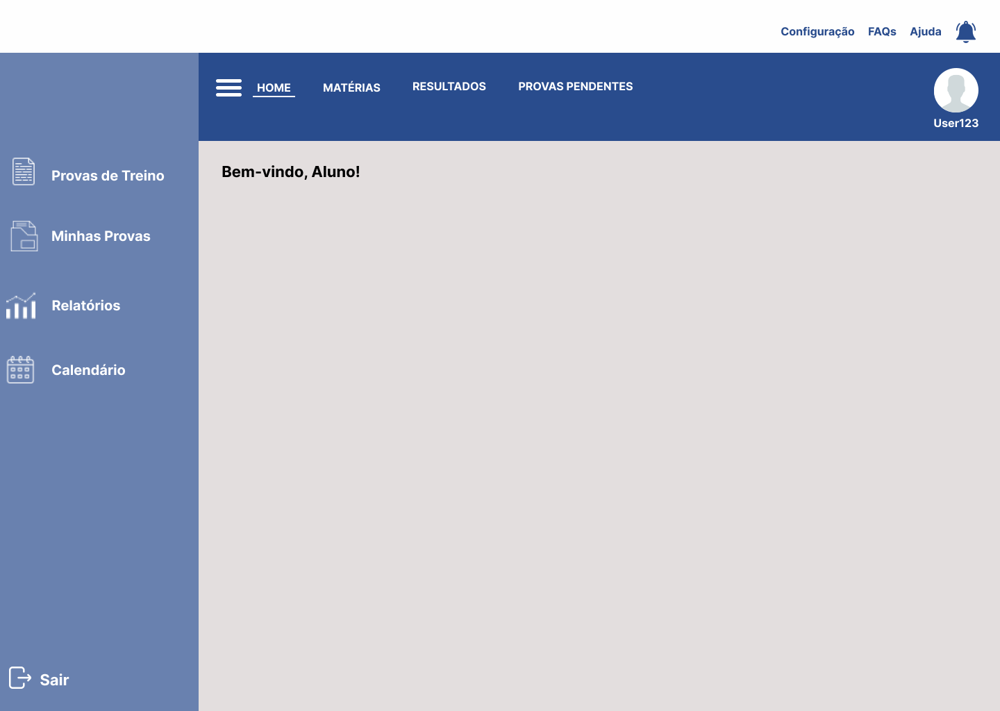

# 📝 EduTest - Sistema de Gestão de Provas e Avaliações

  

## 📌 Sobre o Projeto
O **EduTest** é um projeto conceitual de interface (UI/UX) desenvolvido como trabalho acadêmico em grupo para a faculdade. O objetivo do sistema é centralizar, automatizar e otimizar todo o ciclo de vida de avaliações acadêmicas, integrando em uma única plataforma web as necessidades de administradores, docentes e estudantes.

O design foi totalmente planejado e estruturado utilizando o **Figma**, focando em uma experiência limpa, intuitiva e dividida por níveis de acesso específicos.

---

## 🎭 Níveis de Acesso e Funcionalidades Mapeadas

O sistema foi modularizado em três grandes personas para atender o fluxo escolar de ponta a ponta:

### 1. Painel Administrativo (Admin)
Módulo voltado para o controle operacional e cadastros gerais da instituição.
* **Gerenciamento de Alunos:** Controle de matrículas, cursos (como ADS) e turmas.
* **Controle de Avaliações:** Listagem, monitoramento de duração e gerenciamento de status das provas aplicadas.

### 2. Painel do Professor
Espaço focado na criação de conteúdo e correção.
* **Gerador de Provas Avançado:** Criação dinâmica de avaliações estruturadas com cabeçalho, definição de matéria, tempo limite e tipos variados de questões (mista, múltipla escolha ou discursiva).
* **Banco de Questões:** Repositório para reutilização e consulta de perguntas já criadas.

### 3. Painel do Aluno
Interface simplificada e direta focada na execução de exames.
* **Central de Avaliações:** Acesso rápido a exames pendentes, histórico de resultados e simulados/provas de treino.

---

## 🖼️ Demonstração da Interface (UI/UX)

Abaixo estão os fluxos de tela desenhados para a aplicação:

### Fluxo de Criação de Provas (Visão do Professor)
| Visão Geral do Painel | Construtor de Questões |
| :---: | :---: |
|  |  |

### Fluxo Operacional (Visão do Administrador)
| Gerenciamento de Provas | Controle de Alunos |
| :---: | :---: |
|  |  |

### Visão do Aluno

  

---

## 🔗 Link do Protótipo
O mapeamento completo de componentes, wireframes e fluxo interativo pode ser visualizado diretamente no ambiente de design:
👉 [Acessar Projeto Completo no Figma](INSIRA_O_LINK_COMPARTILHADO_DO_FIGMA_AQUI)

---

Trabalho acadêmico desenvolvido para fins de aprendizado em Design de Sistemas Web.

